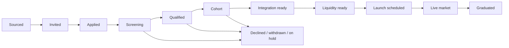

# BOT Chain ecosystem CRM blueprint

Status: combined proposal for review; no product implementation has started.

## Platform model

The product has two connected workspace experiences and one controlled partner surface:

1. **Applicant team workspace** — every startup/project keeps the complete existing CRM and gains BOT Chain integration documentation and agent handoff tools.
2. **Klineo program workspace** — Klineo sources and reviews projects, runs cohorts, tracks integration and liquidity readiness, supports launches, and measures project and program success.
3. **BOT Chain partner view** — BOT Chain sees the explicitly approved pipeline, quality gates, launch state, market outcomes, and grant reporting without receiving unrestricted access to project-private or Klineo-internal records.

The applicant and program records are connected through explicit sharing and status submissions. They are not one undifferentiated database view.

## 1. Correct product model

The primary users are startup teams and projects applying to or participating in the Klineo × BOT Chain program.

Each team receives the existing Bot Combinator workspace and keeps its current functionality:

- investor sourcing and evidence-backed research;
- investor lists and fundraising pipeline;
- introductions and one-to-one outreach;
- meetings, tasks, notes, and documents;
- company and round knowledge;
- Codex/Claude assistance with explicit context disclosure; and
- local vault, backup, audit, and privacy controls.

The requested addition is one new project-facing sidebar tab:

> **BOT Chain Docs**

This tab gives the team a curated BOT Chain integration library. A team can read, search, copy, or download the documentation, and can deliberately provide selected documents to Codex or Claude.

This is not a replacement of the fundraising CRM with a project-cohort CRM. It is the applicant side of a larger platform. Klineo/BOT Chain program administration, cohort reporting, quality gates, liquidity monitoring, and project-success tracking form the connected operator/partner side described later in this document.

## 2. What `BotAgents.md` means

`BotAgents.md` is a portable integration guide for an applicant team's development agent. It is not an internal Klineo agent-governance file.

A team should be able to:

1. Download `BotAgents.md` by itself.
2. Download a complete BOT Chain integration pack.
3. Place the pack inside its own application repository.
4. Tell Codex or Claude to follow `BotAgents.md` and the bundled BOT Chain docs.
5. Ask the agent to analyze the existing application, plan the integration, implement approved work, run tests, and produce an integration-readiness report.

The canonical applicant-facing guide is [BotAgents.md](BotAgents.md).

## 3. Two agent experiences

The interface must distinguish these clearly.

### A. Use inside Bot Combinator

The existing embedded Codex/Claude integration receives only selected, serialized CRM context. It cannot inspect the applicant's external code repository and remains proposal-only.

From the BOT Chain Docs tab, a team can select documents and choose:

- **Ask Codex**
- **Ask Claude**

The app then:

1. shows the selected documents and estimated context size;
2. shows that `bot_chain_docs` will be disclosed for this run;
3. lets the user add a question or choose a prompt template;
4. opens the existing Agent workspace with the provider, prompt, and document selection prefilled; and
5. sends the approved document content through the normal bounded agent-context path.

Useful embedded-agent tasks include:

- explain BOT Chain concepts;
- compare the project's current plan with an integration checklist;
- prepare implementation questions for the engineering team;
- identify missing application information;
- create local tasks or notes as reviewable proposals; and
- summarize changes between documentation versions.

The button must not imply that the embedded agent can edit the team's source code.

### B. Use inside the team's code repository

The team downloads the documentation pack and gives it to its own coding agent, which may have repository access under the team's normal permissions.

For Codex, the pack should include an `AGENTS.md` merge snippet that points to `BotAgents.md`. [Official Codex guidance](https://learn.chatgpt.com/docs/agent-configuration/agents-md) states that Codex automatically discovers `AGENTS.md`; an arbitrary filename such as `BotAgents.md` is only discovered when the user references it or configures it as a fallback. The CRM must not overwrite an existing `AGENTS.md` automatically.

The download flow should therefore offer:

- **Download `BotAgents.md`**
- **Download full integration pack**
- **Copy Codex `AGENTS.md` snippet**
- **Copy prompt for Codex**
- **Copy prompt for Claude**

An optional future action can install the pack into a user-selected local folder, but only after previewing every file and resolving filename conflicts.

## 4. BOT Chain Docs tab

### Navigation

Add `BOT Chain Docs` to the existing Workspace navigation near Knowledge, Agent, and Documents. All other navigation and functionality remain available.

### Page layout

#### Header

- Title: `BOT Chain Docs`
- Description: `Integration documentation for building and launching on BOT Chain.`
- Current bundle version and approval date.
- Data freshness/update state.
- Primary action: `Download integration pack`.

#### Search and categories

- Full-text search over approved document titles, headings, tags, and content.
- Category filter.
- Version/freshness filter.
- `Required`, `Recommended`, and `Reference` labels.

Suggested categories:

1. Start here
2. Network and environment
3. Smart contracts and token standards
4. BDEX integration
5. BO Wallet integration
6. Liquidity and launch readiness
7. Security and testing
8. Deployment and operations
9. Application and program requirements
10. Troubleshooting and known issues

#### Documentation reader

- Table of contents.
- Rendered Markdown and safe code blocks.
- Source/owner, version, approved date, last checked date, and content hash.
- `Copy section`, `Copy code`, and `Download file` actions.
- Clear warnings for stale, superseded, draft, or unavailable material.
- Links between prerequisite and follow-on documents.

#### Agent panel

- Multi-select documents or sections.
- Context-size indication.
- Provider choice: Codex or Claude.
- Prompt templates:
  - `Explain these docs`
  - `Create an integration plan`
  - `Create a readiness checklist`
  - `Identify missing information`
  - `Compare documentation versions`
- `Review context and continue` confirmation.

#### Download panel

- Download `BotAgents.md` only.
- Download selected documents.
- Download the complete versioned pack as a ZIP.
- Copy repository-agent setup instructions.
- Show exact filenames, versions, hashes, and bundle size before saving.

## 5. Documentation pack

Proposed bundle:

```text
botchain-integration-pack/
  BotAgents.md
  AGENTS.botchain-snippet.md
  README.md
  manifest.json
  docs/
    00-start-here.md
    01-network-and-environment.md
    02-contracts-and-token-standards.md
    03-bdex-integration.md
    04-bo-wallet-integration.md
    05-liquidity-and-launch.md
    06-security-and-testing.md
    07-deployment-and-operations.md
    08-application-requirements.md
    09-troubleshooting.md
```

`AGENTS.botchain-snippet.md` is deliberately not named `AGENTS.md`, so extracting the pack cannot overwrite a team's existing project instructions. Its content tells the team what to merge into its root `AGENTS.md`.

Example Codex merge snippet:

```md
## BOT Chain integration

For BOT Chain work, read `./BotAgents.md` first. Follow the versioned documentation under `./docs/` referenced by its manifest. Treat contract addresses, RPC URLs, chain identifiers, and integration requirements as valid only when they appear in the current approved bundle.
```

The Claude setup asset should use the currently supported Claude project-instruction mechanism or a copyable start prompt. Its final filename/format should be confirmed against current official Claude documentation before implementation.

## 6. `BotAgents.md` responsibilities

The downloadable file should tell a coding agent to:

- inspect the applicant's repository before proposing changes;
- determine language, framework, wallet stack, chain libraries, and current integrations;
- read the manifest and only the relevant BOT Chain documentation;
- distinguish verified bundle facts from assumptions and project-specific decisions;
- propose an integration plan before making broad changes;
- preserve the project's existing architecture and conventions;
- never invent chain IDs, RPC URLs, contract addresses, token metadata, BDEX endpoints, or wallet behavior;
- never request, store, expose, or commit seed phrases/private keys;
- implement changes in small reviewable steps;
- run the project's relevant checks and integration tests; and
- produce a final readiness report containing completed work, evidence, tests, remaining manual actions, and unresolved risks.

The initial proposed file is [BotAgents.md](BotAgents.md). It remains a template until authoritative BOT Chain/BDEX/BO Wallet sources are supplied.

## 7. Source and version model

The docs shown in the app must come from a bundled, read-only, approved catalog rather than arbitrary live pages.

Proposed repository source layout:

```text
resources/
  bot-chain/
    manifest.json
    BotAgents.md
    docs/
      ...approved documentation files...
```

Each manifest entry needs:

- stable document ID;
- title, description, category, and tags;
- document version and bundle version;
- canonical source URL or named internal owner;
- retrieved and approved UTC timestamps;
- SHA-256 content hash;
- status: `draft`, `approved`, `stale`, or `superseded`;
- required/recommended/reference importance;
- rights and redistribution status;
- confidentiality/visibility class;
- validity or next-review date;
- supersedes/superseded-by relationship; and
- content size for context-budget calculation.

The first bundle should ship with the application release. A later independent update channel must use signed manifests, integrity validation, rollback protection, and a visible review/update action.

## 8. Minimal data changes

The documentation content itself can remain an immutable packaged resource. SQLite only needs local user state and audit references.

Suggested records:

- `botchain_doc_bundles` — installed bundle version, manifest hash, installed/approved time.
- `botchain_doc_state` — document bookmark, read state, last opened version.
- `botchain_doc_downloads` — selected bundle/doc IDs, destination class, digest, UTC time.
- `botchain_doc_agent_disclosures` — agent run, exact bundle/document versions and hashes disclosed.

New agent context class:

- `bot_chain_docs`

The context selection must contain exact document IDs and versions, not just a blanket permission to read the resource directory.

Potential reviewable proposal extensions:

- create a task from an integration requirement;
- create a project knowledge note;
- create an implementation-readiness checklist; and
- flag a documentation conflict or missing source.

## 9. Commands and application surfaces

Expected read-only operations:

- list/search documents;
- read a document or section;
- read bundle metadata and version history;
- calculate selected context size;
- export `BotAgents.md`, selected files, or the full pack;
- copy a repository-agent snippet/prompt; and
- prepare an agent run with selected document IDs.

All resource paths and export destinations must be resolved by the Electron main process. The renderer should receive typed document content and metadata, never unrestricted filesystem access.

## 10. Safety and trust behavior

- No silent documentation disclosure to an agent.
- No silent file installation into an applicant's repository.
- Never overwrite `AGENTS.md`, project files, or an existing integration pack.
- Show bundle version and document hashes in downloads and agent runs.
- Treat documentation content as untrusted data when sent to an agent; it cannot override the host system prompt.
- Mark unknown or missing technical facts as unknown rather than filling placeholders.
- Never ship credentials, private keys, authenticated URLs, or project secrets in the documentation bundle.
- Warn when a copied/downloaded bundle is no longer current.
- Preserve existing Bot Combinator agent, outbound-message, audit, backup, and privacy boundaries.

## 11. Implementation phases

### Phase 0 — obtain the source corpus

- Receive authoritative BOT Chain, BDEX, and BO Wallet documentation.
- Confirm redistribution rights and internal owners.
- Define the first manifest, categories, bundle version, and review cadence.
- Complete the technical content of `BotAgents.md` without inventing missing values.

### Phase 1 — read and download

- Package the approved resource bundle.
- Add `BOT Chain Docs` navigation, search, categories, reader, source/version metadata, and safe code rendering.
- Add individual and full-pack download flows.
- Add Codex merge snippet and provider-specific copy prompts.

### Phase 2 — use with the embedded agent

- Add `bot_chain_docs` context class and explicit document selection.
- Add exact document/version/hash disclosure records.
- Prefill the existing Agent page from the Docs tab.
- Add integration-plan/checklist task proposals.

### Phase 3 — documentation updates

- Add signed bundle update and rollback behavior if docs need to change outside application releases.
- Add version comparison and stale-copy warnings.

### Parallel product scope — program operations

Project intake, quality gates, cohorts, liquidity monitoring, BOT Chain partner reporting, and shared access are a separate operator-facing workspace within the complete product. They do not redefine `BotAgents.md` or remove the applicant team's existing fundraising tools.

## 12. Acceptance criteria

The extension is complete when an applicant team can:

- use every existing CRM feature without regression;
- open a clearly labeled `BOT Chain Docs` tab;
- search and read the approved integration documentation with source, version, timestamp, and status;
- download `BotAgents.md`, selected docs, or the complete versioned pack;
- copy safe setup instructions for its external Codex/Claude coding workflow;
- select exact documents and knowingly disclose them to the embedded Codex/Claude agent;
- see that the embedded agent can explain and plan but cannot edit the external repository;
- verify which document versions/hashes an agent received;
- avoid overwriting existing project instruction files when extracting the pack; and
- receive an explicit stale/superseded warning when a local pack is older than the approved catalog.

## 13. Inputs still required

Implementation can start with the page/catalog infrastructure, but the downloadable integration pack cannot be called complete until we have:

1. authoritative BOT Chain network and environment documentation;
2. BDEX technical/API/contract documentation;
3. BO Wallet integration documentation;
4. official contract addresses, chain IDs, endpoints, and environment distinctions;
5. security, testing, deployment, and launch requirements;
6. application/cohort requirements intended for applicant teams;
7. document owners, approval dates, update cadence, and redistribution rights; and
8. confirmation of the desired Claude project-instruction packaging.

---

# Part II — Klineo program operations and BOT Chain reporting

## 14. Program outcome

The Klineo program workspace is the operating and evidence layer for the BOT Chain ecosystem program. It must let Klineo and authorized BOT Chain reviewers answer, at any time:

- Which projects have been sourced, invited, applied, screened, accepted, and launched?
- Which cohort is each project in, and what is its current milestone status?
- Which quality, integration, liquidity, security, or operational gates are incomplete or blocked?
- What evidence supports every pass, waiver, launch, and success claim?
- Which BDEX pools and BO Wallet paths are verified, fresh, and working?
- What has changed in liquidity, depth, price impact, activity, and adoption since the baseline?
- Which project or program action is due next, who owns it, and what is blocking it?
- What may be disclosed to BOT Chain, the project, or the public?
- What did the grant fund, and what measurable outcomes were produced?

The CRM is not a custody system, wallet signer, automated market maker, unattended messaging engine, or unattended social publisher.

## 15. Program roles and authority

| Role                         | May do                                                                                | May not do                                                               |
| ---------------------------- | ------------------------------------------------------------------------------------- | ------------------------------------------------------------------------ |
| Klineo program administrator | Configure programs, cohorts, rubrics, reporting periods, roles, and visibility        | Override audit history or project-controlled financial authority         |
| Klineo program operator      | Maintain project records, tasks, milestones, meetings, blockers, and approved reports | Sign treasury actions or mark unsupported outcomes verified              |
| Klineo reviewer              | Review evidence and recommend gate/admission/launch outcomes                          | Make an unrecorded decision or silently waive a gate                     |
| BOT Chain partner viewer     | View fields and reports explicitly approved for BOT Chain                             | View Klineo-internal or project-private material                         |
| BOT Chain partner reviewer   | Comment, acknowledge reports, and participate in configured reviews                   | Edit unrestricted operational records or access other visibility classes |
| Applicant project lead       | Submit application/integration evidence and approved progress updates                 | View another project's records or Klineo-internal scoring notes          |
| Project treasury approver    | Review liquidity policy and simulation material                                       | Delegate signing authority to the CRM or an agent                        |
| Auditor                      | Read immutable source, decision, approval, metric, export, and audit history          | Modify operational records                                               |

Every consequential operation records the actor, role, prior value, new value, rationale, linked evidence, UTC timestamp, and resulting audit-chain event.

## 16. Project lifecycle



Recommended canonical stages:

1. `sourced`
2. `invited`
3. `applied`
4. `screening`
5. `qualified`
6. `cohort`
7. `integration_ready`
8. `liquidity_ready`
9. `launch_scheduled`
10. `live_market`
11. `graduated`
12. `on_hold`
13. `declined`
14. `withdrawn`

Pipeline stage, quality-gate state, cohort state, integration state, liquidity state, and market-health state must remain separate. For example, a project can remain in the cohort while its BDEX gate is blocked; that nuance must not be hidden inside one status label.

Each stage transition records:

- previous and new stage;
- actor and authority role;
- reason and decision reference;
- supporting source/evidence IDs;
- UTC transition time; and
- next owner/action where applicable.

## 17. Intake and applicant-workspace handoff

An applicant team's private CRM is not automatically visible to Klineo or BOT Chain.

The application/submission flow should let the team preview and explicitly submit a bounded program package containing only agreed fields, such as:

- project identity and canonical team contacts;
- product summary and current build state;
- public links and selected documents;
- BOT Chain integration readiness checklist;
- requested cohort/program support;
- approved milestones or status updates; and
- specific evidence the team elects to disclose.

Each submission creates an immutable version with a digest. Later submissions do not rewrite what reviewers saw earlier. Klineo can request changes or missing information through the program workspace; the project decides which private-workspace records to include in its response.

Klineo-internal scoring, reviewer notes, conflicts, and comparative cohort analysis do not flow back to the applicant unless explicitly released.

## 18. Quality gates

Each gate uses `not_started`, `in_review`, `needs_work`, `passed`, `blocked`, or `waived` state. A waiver requires an authorized human, reason, compensating controls, expiry/review date, and audit event.

Initial gate set:

1. **Team and identity** — canonical team contacts, roles, entity information, relevant experience, authority, and conflicts disclosed.
2. **Product readiness** — working product/demo, clear user problem, roadmap, operating owner, and current evidence.
3. **Technical readiness** — architecture, repository/build state, dependencies, deployment model, and unresolved technical risks.
4. **Security readiness** — contract review/audit status, threat/risk evidence, incident contact, key-management design, and unresolved findings. The CRM records evidence; it does not manufacture a security certification.
5. **Market and community readiness** — target users, adoption evidence, community plan, and explicit demand assumptions.
6. **Token and treasury readiness** — token details, treasury authority, Safe/multisig design, approvals, limits, and disclosed constraints.
7. **BOT Chain integration** — required network, contract, testing, and deployment evidence from the versioned integration bundle.
8. **BDEX readiness** — verified asset/pool identifiers, venue flow, test evidence, launch dependencies, and monitoring owner.
9. **BO Wallet readiness** — connection, network, discovery, signing, rejection, and recovery-path test evidence.
10. **Liquidity readiness** — pair selection, budget, ranges, scenarios, risk limits, policy, monitoring owner, and pause/rollback conditions.
11. **Launch operations** — launch window, owner, runbook, communications, monitoring, escalation, and post-launch review.
12. **Reporting readiness** — KPI definitions, baseline sources, reporting owner, disclosure consent, and data-quality rules.

Gate definitions must be versioned. A review retains the exact rubric/policy/document version used at the time.

## 19. Cohort operations

The program workspace must support:

- multiple named cohorts with thesis, dates, capacity, owners, and status;
- application and acceptance windows;
- project membership and admission decision history;
- reusable milestone templates with project-specific overrides;
- owners, dependencies, due dates, evidence, and completion criteria;
- weekly status, blocker age, escalation level, and next action;
- meetings, agendas, notes, and follow-up tasks;
- integration, liquidity, launch, and reporting readiness views; and
- cohort graduation decision and evidence.

Recommended milestone categories:

- application and onboarding;
- product and technical delivery;
- security/risk review;
- BOT Chain integration;
- BDEX integration;
- BO Wallet integration;
- liquidity planning;
- launch preparation;
- community/public programming;
- live-market monitoring; and
- reporting/graduation.

Milestone completion must require the defined evidence, not only a checked box.

## 20. Liquidity and market-health boundary

The first release tracks evidence, policies, simulations, approvals, and read-only outcomes. It does not control treasury assets.

It may store:

- verified chain, asset, token, and pool identifiers;
- liquidity budgets and project-reported treasury constraints;
- policy versions and permitted ranges;
- scenario/simulation inputs and outputs;
- required project/Klineo approver roles;
- pause and escalation conditions;
- read-only BDEX snapshots;
- data-quality/freshness state;
- reconciled operational notes; and
- links to externally executed, human-controlled actions.

It must not:

- request or store private keys/seed phrases;
- sign or broadcast transactions;
- claim operational approval is wallet authorization;
- automatically add/remove liquidity, swap, rebalance, or market make;
- recommend wash trading, deceptive liquidity, artificial volume, or price guarantees; or
- continue analysis as if market data were valid when its quality/freshness checks fail.

Any future Safe/multisig proposal preparation or execution workflow is a separate security-critical project requiring its own threat model, authorization design, reconciliation, incident controls, and approval.

## 21. Program data model

The current schema is version 9; the next released migration would be version 10. Final names and relationships should be approved before implementation.

### Programs and projects

- `ecosystem_programs` — program, partner, grant period, owners, reporting cadence, status.
- `ecosystem_projects` — canonical project identity, entity, product state, origin, visibility, timestamps.
- `project_contacts` — person/project role, authority, primary contact, visibility.
- `project_submissions` — immutable applicant-submitted payload versions and digests.
- `project_stage_events` — append-only lifecycle transitions.
- `project_decisions` — admission, hold, waiver, launch, graduation, and other governed decisions.

### Cohorts and execution

- `cohorts` — name, thesis, dates, capacity, owners, status.
- `cohort_memberships` — project/cohort state and admission/completion dates.
- `quality_gate_definitions` — versioned gates and pass/evidence criteria.
- `quality_gate_reviews` — project, gate version, reviewer, state, evidence, rationale, reviewed time.
- `milestone_templates` — reusable program/cohort requirements and versions.
- `milestones` — project/cohort milestone, owner, dependencies, due date, evidence, state.
- `blockers` — severity, owner, gate/milestone relationship, opened/closed time, resolution.

### Documentation and evidence

- `document_records` — logical program/project document, category, owner, visibility.
- `document_versions` — source/path reference, content hash, version, timestamp, rights, parser, supersession state.
- Existing sources, claims, notes, tasks, meetings, knowledge, and audit records should be extended to support program/project entities instead of bypassed.

### Integration, liquidity, and market health

- `integration_requirements` — versioned BOT Chain/BDEX/BO Wallet requirement linked to documentation IDs.
- `integration_reviews` — project requirement state, evidence, reviewer, environment, timestamps.
- `chain_assets` — chain ID, address, symbol, decimals, verification state, source.
- `dex_pools` — venue, pool address, pair assets, fee tier, creation/verification state.
- `market_snapshots` — pool, UTC time, block where available, source, method version, raw digest.
- `metric_definitions` — name, formula, unit, inclusions/exclusions, freshness, version.
- `market_metrics` — snapshot, definition, value, unit, confidence/data-quality state.
- `liquidity_policies` — bounds, allowed proposal types, pause conditions, approver roles, version.
- `liquidity_action_proposals` — simulation/recommendation only, never a signed transaction.
- `liquidity_action_reviews` — approve/reject/request-changes operational decision.

### Programming and reporting

- `program_events` — Twitch/X Live session, project, format, owner, date, readiness, links, outcome.
- `reporting_periods` — grant reporting window and baseline reference.
- `kpi_definitions` — versioned formula, unit, source, exclusions, freshness rule.
- `kpi_observations` — period/project value, timestamp, evidence source, quality state.
- `partner_report_exports` — immutable generated report digest, disclosure profile, creator, time.
- `partner_comments` — scoped BOT Chain feedback or acknowledgement without unrestricted record mutation.

## 22. Success measurement

No KPI appears without a definition, reporting period, source, UTC observation time, and data-quality/freshness state.

### Funnel and cohort KPIs

- projects sourced, invited, applied, screened, qualified, accepted, launched, live, and graduated;
- conversion rates between agreed stages;
- median time in each stage;
- acceptance, withdrawal, and hold rates with reason categories;
- gate pass/needs-work/blocked/waiver rate;
- milestone on-time completion and blocker age;
- cohort completion and graduation rate; and
- project retention/activity after launch.

### Integration KPIs

- projects completing BOT Chain network integration;
- verified BDEX integrations and pools;
- verified BO Wallet discovery/connection/signing flows;
- integration test completion and unresolved defect count;
- time from cohort admission to integration-ready and launch-ready; and
- documentation version/freshness compliance.

### Liquidity and market-quality KPIs

- verified active pools;
- total and non-BOT/WBOT liquidity in USD;
- depth at agreed price bands, such as plus/minus 1%, 2%, and 5%;
- estimated price impact at agreed quote sizes;
- spread, volume, trades, and unique trader estimates where supported;
- liquidity-provider concentration;
- data-source uptime/freshness; and
- number/duration of market-health alerts and policy pauses.

### Ecosystem and public-program KPIs

- Twitch/X Live sessions and participating projects;
- live/recorded reach using source-specific definitions;
- attributable applications, wallet connections, project follows, or other agreed actions;
- project/user feedback; and
- partner or community introductions resulting from program activity.

Definitions such as `screened`, `launched`, `live market`, `active pool`, `non-BOT liquidity`, `cohort completion`, and `ecosystem reach` must be agreed before targets are set.

The pitch claim that more than 99% of observed BDEX liquidity is concentrated in BOT and WBOT remains a draft until the CRM contains the exact source, UTC timestamp, block/snapshot, included pools, valuation method, treatment of BOT/WBOT pair sides, and reproducible calculation.

## 23. Program agent model

The program workspace uses the internal [BOT Chain agent operating contract](bot-chain-agent-operating-contract.md). It is separate from the applicant-downloadable [BotAgents.md](BotAgents.md).

New opt-in program agent context classes:

- `program`
- `projects`
- `submissions`
- `cohorts`
- `bot_chain_docs`
- `integration_readiness`
- `liquidity`
- `market_health`
- `private_activity`
- `reporting`

New reviewable proposal types:

- `project_update`
- `project_stage_change`
- `gate_review`
- `milestone`
- `blocker`
- `integration_readiness_review`
- `liquidity_readiness_review`
- `report_draft`
- `program_event_brief`

Agents can analyze and propose. Typed host commands, schema validation, authority checks, and a human review apply changes. No agent capability exists for project admission, gate waiver, wallet signing, transactions, external sending, provider writes, or publishing.

## 24. Program information architecture

Klineo operator navigation:

- **Up next** — blockers, overdue gates, stale data, pending decisions, and launches.
- **Projects** — canonical project registry, submissions, evidence, and status.
- **Pipeline** — lifecycle stages and immutable decision history.
- **Cohorts** — membership, milestones, owners, blockers, and completion.
- **Integration** — BOT Chain, BDEX, and BO Wallet requirement/evidence tracking.
- **Liquidity** — readiness, policies, simulations, and human approvals.
- **Market health** — pool snapshots, trends, freshness, alerts, and investigations.
- **Events** — Twitch/X Live calendar, project readiness, briefs, and outcomes.
- **Reports** — grant scorecard, periods, KPI evidence, and exports.
- **Knowledge & sources** — program docs, project evidence, claims, and review queue.
- **Agent & proposals** — disclosed context, runs, pending changes, and review.
- **Settings** — program, roles, visibility, connectors, retention, backup, and audit.

Project detail tabs:

1. Overview
2. Team and contacts
3. Application/submissions
4. Quality gates
5. Cohort and milestones
6. Integration readiness
7. Liquidity and pools
8. Documents and evidence
9. Meetings, tasks, and activity
10. Decisions and audit

BOT Chain partner view:

- approved pipeline summary;
- cohort progress and disclosed blockers;
- integration/liquidity/launch readiness;
- approved market-health metrics;
- reporting-period KPI scorecard;
- project/event highlights; and
- comments, acknowledgements, and pending review items within the partner role.

## 25. Sharing and deployment strategy

### Phase A — local Klineo program workspace

- Klineo remains the only program writer.
- Applicant teams use independent local workspaces and make explicit submission exports.
- Klineo generates a redacted, reviewable BOT Chain scorecard/report.
- Every export previews included projects, fields, documents, metrics, and visibility.
- Every export is hashed and audited.
- This is not described as real-time shared CRM access.

### Phase B — authenticated applicant submissions

- Project identity and invitation/authentication.
- Submission-only API/portal with strict project isolation.
- Versioned submission packages and Klineo request/response workflow.
- No access to the project's unrelated fundraising/private CRM records.

Implemented in `apps/portal` with the explicit desktop submission export; production activation follows `docs/portal-deployment.md`.

### Phase C — BOT Chain partner portal

- Authenticated identities, invitations, and role-based access.
- Row/field-level visibility enforcement.
- Server-side audit, encrypted transport/storage, backups, retention, incident response, and tenant isolation.
- Review/comment/acknowledgement workflow without unrestricted edits.

Implemented as a restricted role in the same hosted portal. Stored visibility approvals determine every BOT Chain/public record; deployment operations, backups, SMTP, and incident response remain environment-owner responsibilities.

The architecture decision between signed read-only reports and a live partner portal must be settled before a grant agreement promises “shared real-time CRM access.”

## 26. Combined implementation sequence

### Phase 0 — contracts and authoritative sources

- Confirm applicant, Klineo, and BOT Chain roles/authority.
- Obtain authoritative BOT Chain, BDEX, and BO Wallet documentation/data interfaces.
- Approve lifecycle stages, quality gates, cohort templates, visibility matrix, KPI definitions, and reporting cadence.
- Establish reproducible BDEX baseline methodology and grant targets.

### Phase 1 — applicant experience and documentation

- Preserve every existing CRM workflow.
- Add the BOT Chain Docs catalog, reader, search, downloads, `BotAgents.md`, and agent handoff.
- Add explicit application/program submission preview and immutable export.

### Phase 2 — Klineo project and cohort CRM

- Add the program/project/cohort schema, repositories, validation, commands, and audit events.
- Build Projects, Pipeline, Cohorts, gates, milestones, blockers, submissions, and detail views.
- Extend tasks, meetings, notes, sources, documents, and knowledge to program/project scope.
- Add redacted partner-report export.

### Phase 3 — proposal-only program agents

- Add program context classes, MCP read tools, proposal schemas, authority-aware review UI, and audit.
- Test prompt-injection resistance, record-level authorization, redaction, stale sources, and apply-time revalidation.

### Phase 4 — read-only integration and market data

- Add approved BOT Chain/BDEX/BO Wallet read-only adapters after their interfaces are known.
- Add identity verification, snapshots, raw digests, calculations, freshness, and data-quality alerts.

### Phase 5 — authenticated submissions and partner access

- Implement the chosen shared architecture only after hosting, privacy, retention, roles, and operations are approved.

### Phase 6 — controlled liquidity operations (separate approval)

- If required, design simulation, multisig/Safe proposal preparation, reconciliation, incident controls, and security review as a separate project.
- Do not extend the CRM or agents directly into autonomous signing/broadcasting.

## 27. Combined acceptance criteria

The end-to-end platform is complete only when:

- applicant teams retain every existing CRM feature and gain the BOT Chain Docs/agent pack experience;
- a team can preview and submit only approved application/integration evidence;
- Klineo can create/merge canonical projects and track immutable submission/stage history;
- projects can be admitted to cohorts with versioned decisions, gates, milestones, blockers, owners, due dates, and evidence;
- BOT Chain/BDEX/BO Wallet readiness can be recorded without claiming untested integration;
- liquidity and market metrics show formula, source, UTC time, version, and stale/error state;
- agents receive only selected context and every proposed change requires human review and authority validation;
- Klineo can generate a redacted, evidence-backed BOT Chain grant report;
- BOT Chain can see only its approved partner view and cannot access project-private/Klineo-internal records;
- every consequential decision, disclosure, metric, and report export is auditable; and
- no CRM or agent tool can sign transactions, move funds/liquidity, admit a project, waive a gate, send communications, or publish content without the required human-controlled workflow.

## 28. Decisions required before implementation

1. Are applicant, Klineo, and BOT Chain experiences separate deployments, workspace modes, or authenticated roles in one hosted product?
2. Is the first BOT Chain deliverable a signed/read-only report or true multi-user access?
3. Who has final authority for admission, gate waiver, launch approval, graduation, and report approval?
4. Which BOT Chain, BDEX, and BO Wallet sources/endpoints are authoritative?
5. What exact KPI definitions, baseline, targets, and reporting periods does the grant use?
6. Which fields are project-private, project-to-Klineo, Klineo-internal, BOT-visible, or public?
7. Which parts of an applicant's CRM may ever be submitted, and how is consent/version history recorded?
8. Is any future liquidity workflow informational, Safe proposal preparation, or a separately controlled operating service?
9. What hosting, retention, deletion, data-location, incident-response, and audit obligations apply?
10. Which name/spelling is canonical across product and grant materials: Klineo or another form?
